JENKINS END TO END IMPLEMENTATION - CICD PROJECT


Jenkins Pipeline for Java based application using Maven, SonarQube, Argo CD and Kubernetes (KIND)


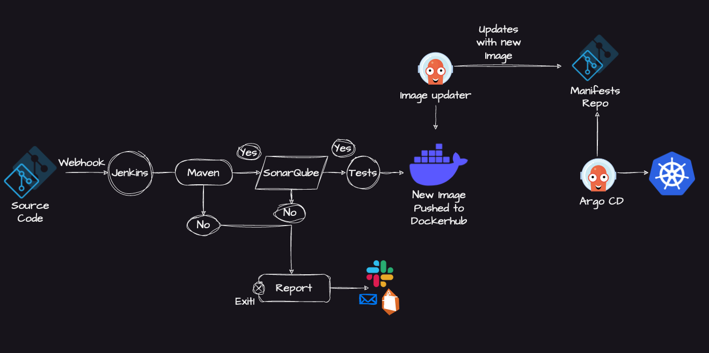


Prerequisites :

- Java application hosted on a Git repository
- EC2 instances (t2.large) : 2
- Java : Jdk17 
- Jenkins
- Docker
- DockerHub image repository
- SonarQube 
- Kind and Kubectl 
- ArgoCD 


- Install Java, Jenkins, Docker and SonarQube on EC2 instance (t2.large)

```
sudo apt update
sudo apt install openjdk-17-jdk -y
java -version

```

- Jenkins requires Java (done in Step 1), so now install Jenkins:

```
curl -fsSL https://pkg.jenkins.io/debian-stable/jenkins.io-2023.key | sudo tee \
  /usr/share/keyrings/jenkins-keyring.asc > /dev/null

echo deb [signed-by=/usr/share/keyrings/jenkins-keyring.asc] \
  https://pkg.jenkins.io/debian-stable binary/ | sudo tee \
  /etc/apt/sources.list.d/jenkins.list > /dev/null

sudo apt update
sudo apt install jenkins -y

```

- Start and enable jenkins:

```
sudo systemctl start jenkins
sudo systemctl enable jenkins

```
```
sudo systemctl status jenkins

```
- Open Jenkins in your browser:

```
http://public-ip:8080

```
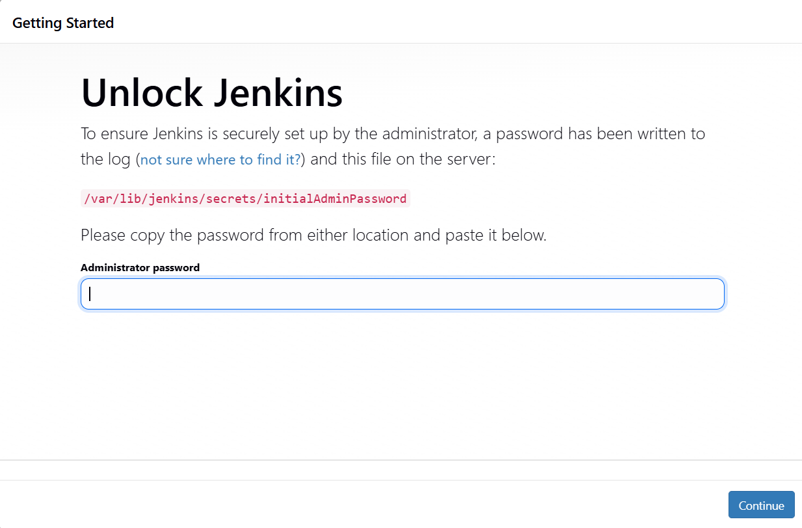


- To get the initial admin password:

```
sudo cat /var/lib/jenkins/secrets/initialAdminPassword
```

- Install suggested plugins on jenkins:

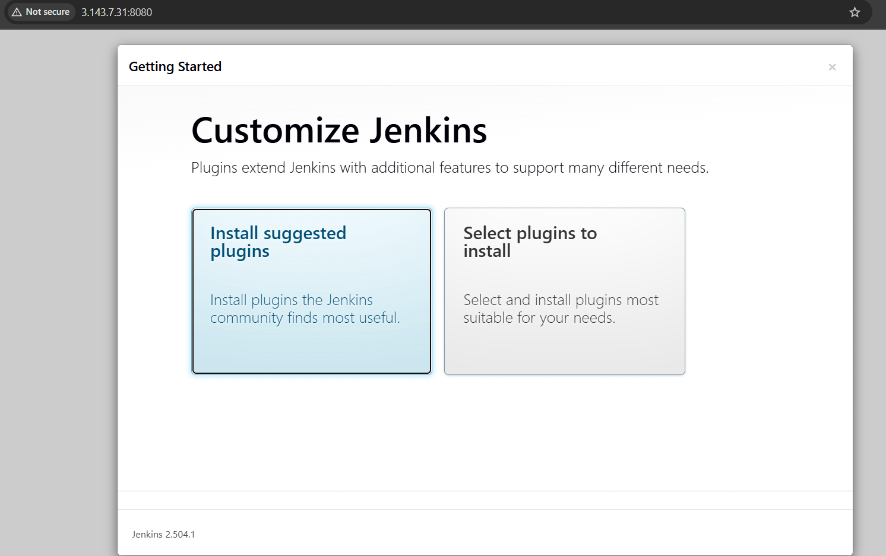


- Install Docker:

```
sudo apt install docker.io -y
```

- Grant permission to Ubuntu user and jenkins user to docker daemon:

```
sudo usermod -aG docker $USER 
sudo usermod -aG docker jenkins
sudo systemctl restart docker
```

- Run SonarQube using Docker as container:

```
docker run -d --name sonar -p 9000:9000 sonarqube:lts-community
```

- Check sonar container running:

```
docker ps
```

- Access sonarqube server on:

```
http://public-ip:9000
```

- Create access token for jenkins:

Goto administration -> security -> users -> update token to 1,Generate token - name it (copy this to create credentials for jenkins)


- Install plugins: 

Goto Manage Jenkins -> Available plugins

- Docker 
- Sonarqube scanner


- Create Jenkins global credentials:

Goto Manage Jenkins -> credentials

DockerHub (kind - username and password) - ID - docker-cred
Sonarqube (kind - secret text) - ID - sonar [Go to sonarqube server->administration ->security -> users -> Generate token and copy it for future use]
Github (kind - secret text) - ID - github [ Create access token from github profile -> settings -> personal access token classic ]


- Create job

Name
- Description
- Select Pipeline - Pipeline script from SCM
- SCM - Git
- Git Repository URL - https://github.com/ritikasharm1505/Jenkins-Zero-To-Hero
- Branch specifier - */main
- Script Path - java-maven-sonar-argocd-helm-k8s/spring-boot-app/JenkinsFile

Apply and Save

- Configure build:

- Update the Sonar-server URL and credentials in the JenkinsFile according to yours


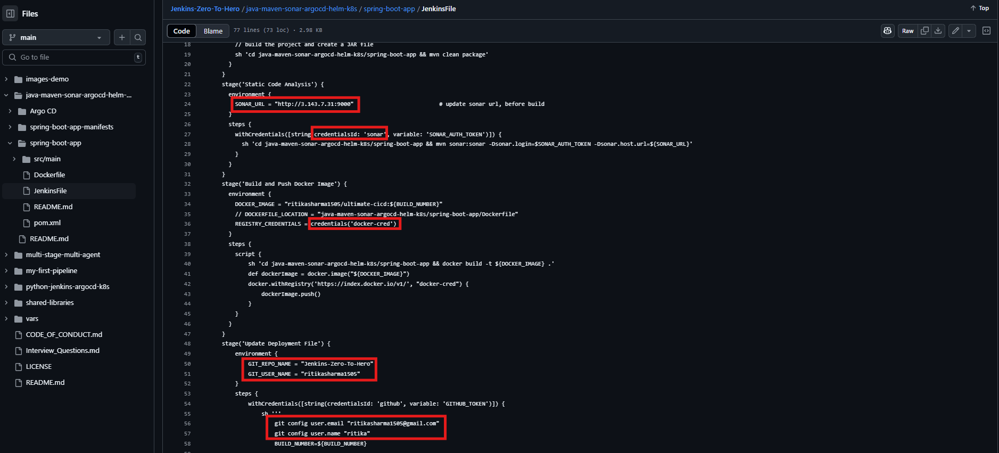


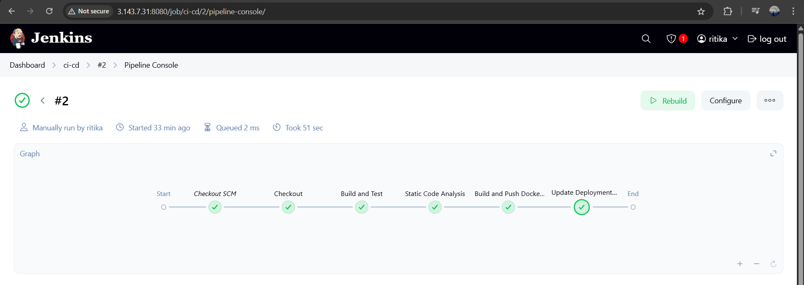


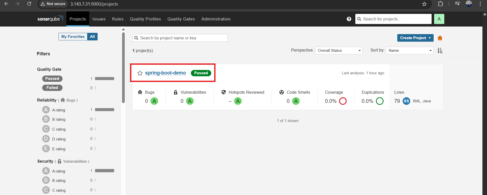


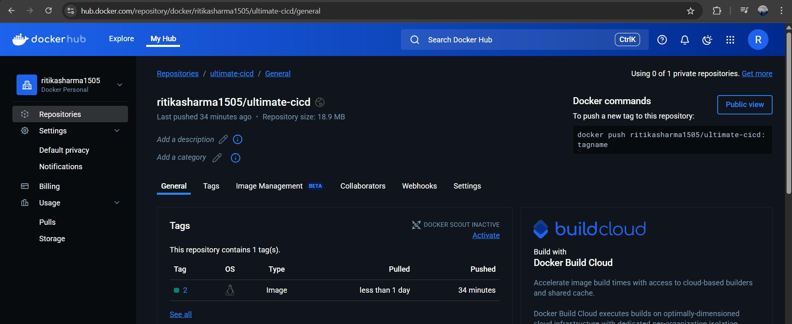


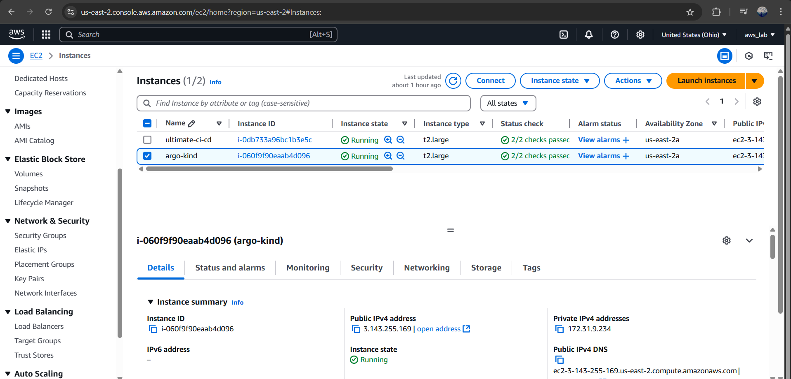


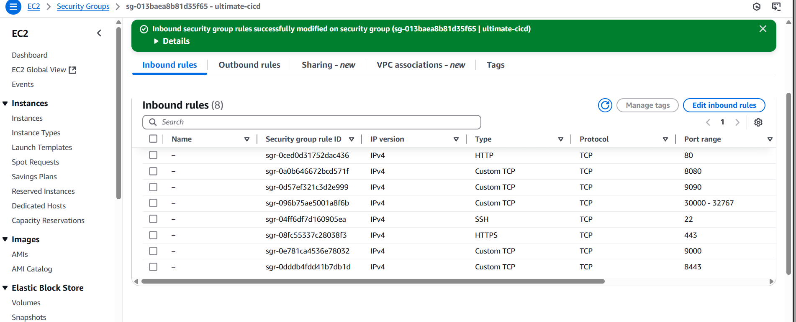


## Now, let’s setup Kubernetes cluster (Kind) and ArgoCD to deploy the spring boot app


- Update packages and Install docker:

```
sudo apt update
sudo apt install docker.io -y
```

- Give permissions to user 

```
sudo usermod -aG docker $USER
```

- Install Kind and Kubectl:

create a 'kind.sh' file : 

```
#!/bin/bash

[ $(uname -m) = x86_64 ] && curl -Lo ./kind https://kind.sigs.k8s.io/dl/v0.27.0/kind-linux-amd64
chmod +x ./kind
sudo mv ./kind /usr/local/bin/kind

VERSION="v1.30.0"
URL="https://dl.k8s.io/release/${VERSION}/bin/linux/amd64/kubectl"
INSTALL_DIR="/usr/local/bin"

curl -LO "$URL"
chmod +x kubectl
sudo mv kubectl $INSTALL_DIR/
kubectl version --client

rm -f kubectl
rm -rf kind

echo "kind & kubectl installation complete."
```

- Give permissions to execute and run script:

```
sudo chmod +x kind.sh
./kind.sh
```

- Setting up the KIND cluster:

Create a 'kind-cluster-config.yaml' file:

```
kind: Cluster
apiVersion: kind.x-k8s.io/v1alpha4

nodes:
- role: control-plane
  image: kindest/node:v1.31.2
- role: worker
  image: kindest/node:v1.31.2
- role: worker
  image: kindest/node:v1.31.2

```

- Create the cluster using the configuration file:

```
kind create cluster --config kind-cluster-config.yaml --name ci-cd
```

- Verify the cluster:

```

kubectl get nodes
kubectl cluster-info

```

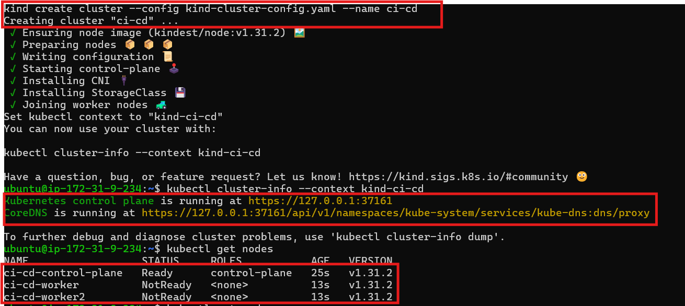


## Now let's install ArgoCD to deploy the app:

- Create a namespace for ArgoCD:

```
kubectl create namespace argocd
```

- Apply the ArgoCD manifest:

```
kubectl apply -n argocd https://raw.githubusercontent.com/argoproj/argo-cd/stable/manifests/install.yaml
```

- Check services in ArgoCD namespace:

```
kubectl get svc -n argocd
```

- Expose ArgoCD server using nodeport:

```
kubectl patch svc argocd-server -n argocd -p '{"spec": {"type": "NodePort"}}'
```

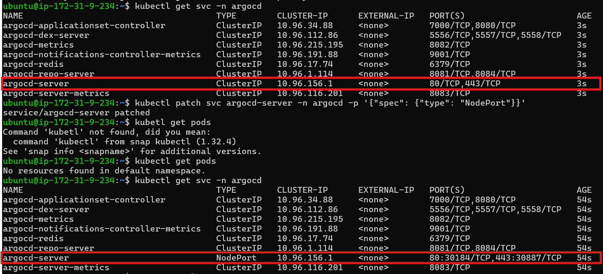


- Port forward to access ArgoCD server:

```
kubectl port-forward -n argocd service/argocd-server 8443:443 --address=0.0.0.0 &
```

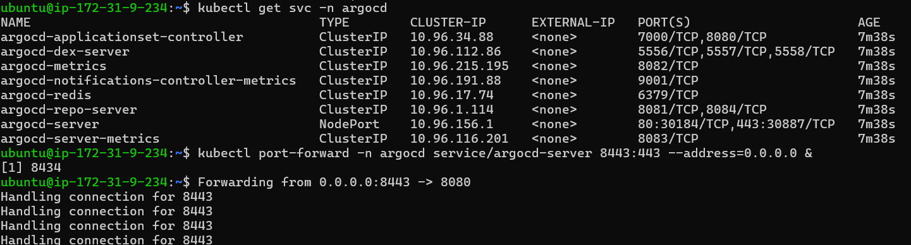

- Access ArgoCD UI on browser: 

```
https://public-ip:8443
```

- Retrieve ArgoCD Initial password:

```
kubectl get secret -n argocd argocd-initial-admin-secret -o jsonpath="{.data.password}" | base64 -d && echo
```

Create Application:
Name 
Default
Repo URL -
Path -
Namespace - default

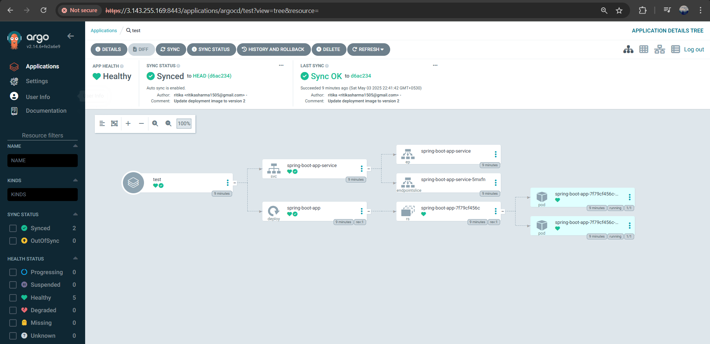

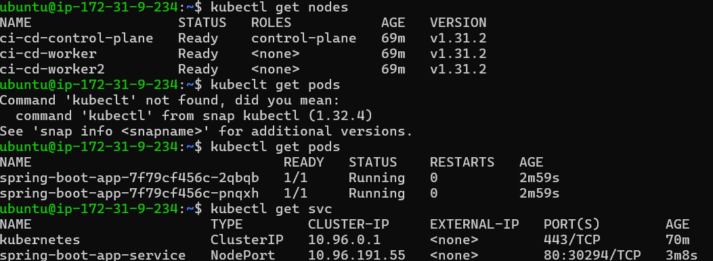


- To access the spring boot app port forward:

```
kubectl port-forward pod/<podname> 9090:8080 --address=0.0.0.0 &
```

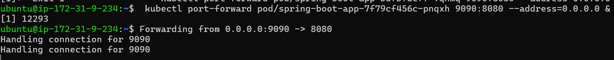

- Finally, access the spring boot app on the browser 👏

```
http://public-ip:9090
```


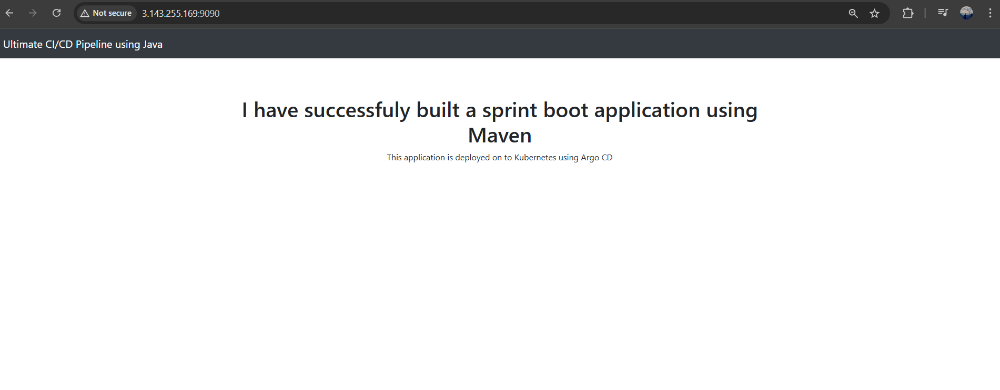


### Trouble shooting :

- Make sure of correct path given in pipeline configuration for the Jenkinsfile

- Docker sock related error, use this command : 

```
sudo usermod -aG docker ubuntu && newgrp docker 
sudo systemctl restart docker
```
or

```
sudo usermod -aG docker ubuntu && newgrp docker
sudo usermod -aG docker jenkins
sudo systemctl restart jenkins
```

- Don't forget to update sonar URL in the Jenkinsfile, before running the build

- Make sure to install kind, kubectl, docker on kind-Argo instance before creating cluster 

- The deployment.yaml keeps updating the tag, make sure before rebuild update it to image: <dockerhub-username>/ultimate-cicd:replaceImageTag

